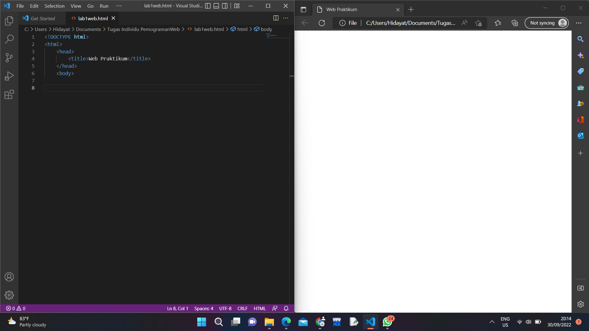
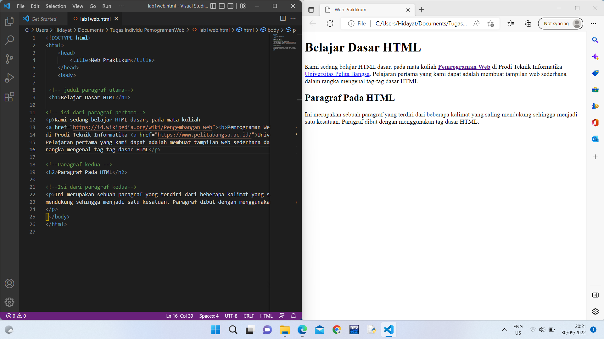

# Lab1Web1
## Hidayat Tulloh
## 312110110
## TI.21.B.1

1. membuat file baru dan menambahkan judul "web pratikum"

2. membuat paragraf dan judul
 
3. membuat format teks dengan tag "<mark>""<b>""<i>"

4. menambahkan gambar atau logo universitas pelita bangsa

5. menambahkan Hyperlink/Halaman2

# Jawab Pertanyaan Berikut
1. Lakukan perubahan pada code sesuai dengan keinginan anda, amati perubahannya adakah error ketika terjadi kesalahan penulisan tag?

saat merubah terkadang keliru dengan penulisan tag yang benar sehingga html tidak mengenali tag tersebut tetapi masih bisa di tampilkan  

2. Apa perbedaan dari tag `
` dengan tag ` ` berikan penjelasannya!

tag   melompati satu line cocok untuk memulai paragraf baru dan tag 
 seperti menekan enter di software document editor 

3. Apa perbedaan atribut `title` dan `alt` pada tag ``, berikan penjelasannya!

Perbedaan atribut title dan alt yaitu pada gambar yang dihasilkan. Ketika gambar berhasil ditampilkan maka akan terlihat sebuah title, sedangkan jika gambar gagal ditampilkan maka akan menampilkan teks dalam atribut alt tersebut

4. Untuk mengatur ukuran gambar, digunakan atribut `width` dan `height`. Agar tampilan gambar proporsional sebaiknya kedua atribut tersebut diisi semua atau tidak? Berikan penjelasannya!

menurut saya lebih baik satu attribut saja agar aspek ratio gambar asli terjaga 

5. Pada `link` tambahkan atribut `target` dengan nilai atribut bervariasi (`_blank`, `_self`, `_top`, `_parent`), apa yang terjadi pada masing-masing nilai antribut tersebut?

Nilai _blank akan membuka link/halaman di tab baru.
Nilai _self akan membuka link/halaman di tab saat ini.
Nilai _top membuka link/halaman dan membatalkan semua frame.
Nilai _parent membuka link/halaman pada parent frame.
